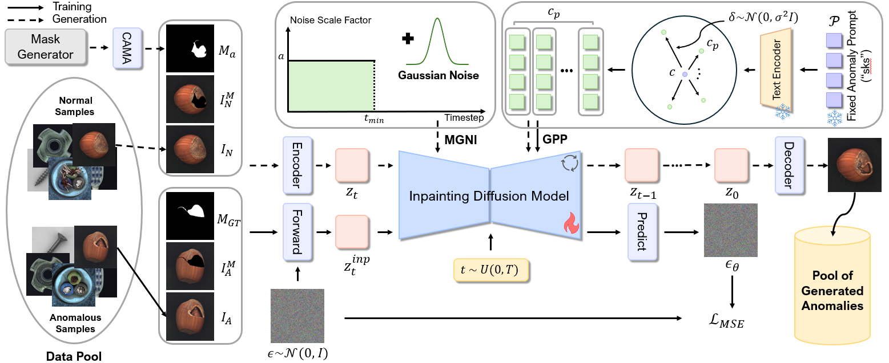

# MAGIC: Mask-Guided Diffusion Inpainting with Multi-Level Perturbations and Context-Aware Alignment for Few-Shot Anomaly Generation

[](https://arxiv.org/abs/2507.02314)

## Abstract

Few-shot anomaly generation is emerging as a practical solution for augmenting the scarce anomaly data in industrial quality control settings. An ideal generator would meet three demands at once, namely (i) keep the normal background intact, (ii) inpaint anomalous regions to tightly overlap with the corresponding anomaly masks, and (iii) generate anomalous regions in a semantically valid location, while still producing realistic, diverse appearances from only a handful of real examples. Existing diffusion-based methods usually satisfy at most two of these requirements: global anomaly generators corrupt the background, whereas mask-guided ones often falter when the mask is imprecise or misplaced. We propose MAGIC--Mask-guided inpainting with multi-level perturbations and Context-aware alignment--to resolve all three issues. At its core, MAGIC fine-tunes a Stable Diffusion inpainting backbone that preserves normal regions and ensures strict adherence of the synthesized anomaly to the supplied mask, directly addressing background corruption and misalignment. To offset the diversity loss that fine-tuning can cause, MAGIC adds two complementary perturbation strategies: (i) Gaussian prompt-level perturbation applied during fine-tuning and inference that broadens the global appearance of anomalies while avoiding low-fidelity textual appearances, and (ii) mask-guided spatial noise injection that enriches local texture variations. Additionally, the context-aware mask alignment module forms semantic correspondences and relocates masks so that every anomaly remains plausibly contained within the host object, eliminating out-of-boundary artifacts. Under a consistent identical evaluation protocol on the MVTec-AD dataset, MAGIC outperforms previous state-of-the-arts in downstream anomaly tasks.

<p align="center">
  
</p>

## 🔧 Environment Setup (Main Inpainting Model)

This environment is used for training and inference of our **Stable Diffusion Inpainting-based anomaly generation model**.

1. Create and activate the conda environment:
```bash
conda create -n magic python=3.9
conda activate magic
```

2. Install CUDA and PyTorch:
```bash
conda install -c conda-forge cudatoolkit=11.8
pip install torch torchvision torchaudio --index-url https://download.pytorch.org/whl/cu118 --upgrade
```

3. Install other dependencies:
```bash
pip install -r requirements.txt
pip install opencv-python
```

4. Clone and set up diffusers:
```bash
git clone https://github.com/huggingface/diffusers.git
cd diffusers
pip install -e .
```

5. Add the Custom Pipeline

Copy the `pipeline_stable_diffusion_inpaint_magic.py` file to the following directory:

```
diffusers/src/diffusers/pipelines/stable_diffusion/
```

Example command:

```bash
mv pipeline_stable_diffusion_inpaint_magic.py diffusers/src/diffusers/pipelines/stable_diffusion/
```


## 📦 Data Preparation

### ✅ 1. Download MVTec AD Dataset
Download from: https://www.mvtec.com/company/research/datasets/mvtec-ad  
Extract it to a target directory and use the path when running training or inference.

### ✅ 2. Generate Foreground Masks using U-2-Net
- **Source:** https://github.com/xuebinqin/U-2-Net  
- **License:** Apache License 2.0

This model is used to extract **foreground masks** from normal images.
Save the generated mask as:
```
<dataset_root>/<category>/train/good/<image_filename>_mask.png
```
Example:
```
mvtec_ad/screw/train/good/000.png → obj_foreground_mask/screw/train/good/000_mask.png
```

---

## 🔍 Semantic Matching (GeoAware-SC, for CAMA)

GeoAware-SC is used to compute **keypoint matches between normal and defective images**, and is required for our CAMA module.
> ⚠️ This runs in a **separate environment** from the inpainting model.

- **Source:** https://github.com/Junyi42/GeoAware-SC  
- **License:** Not specified (assumed all rights reserved)

### 🔧 Setup Instructions:

1. Clone GeoAware-SC:
```bash
git clone https://github.com/Junyi42/GeoAware-SC.git
```

2. Add the Matching Script

Move the `CAMA_matching.py` file into the cloned folder:

```
GeoAware-SC/CAMA_matching.py
```

Example command:

```bash
mv CAMA_matching.py GeoAware-SC/CAMA_matching.py
```


3. Follow GeoAware-SC setup guide (e.g., install dependencies).

4. Run the following to generate `matching_result.json`:
```bash
python CAMA_matching.py \
  --mvtecad_dir /path/to/mvtec_ad \
  --categories screw \
  --img_size 480 \
  --out_dir ./matching_output \
  --mask_root /obj_foreground_mask
```

> Replace `screw` with the desired category name.  
The resulting `matching_result.json` file will be saved inside the specified `--out_dir` folder, and is required for inference.
---

## 🚀 Training & Inference (Example Category: screw)

### ✅ Training
To train on the screw category:
```bash
python run_train.py \
  --base_dir /path/to/mvtec_ad \
  --output_name output_name \
  --text_noise_scale 1.0 \
  --category screw
```

> Replace `screw` with any other category name from MVTec AD.
### ✅ Inference
To run inference with trained checkpoints:
```bash
python inference.py \
  --model_ckpt_root /path/to/trained/ckpt \
  --categories screw \
  --text_noise_scale 1.0 \
  --defect_json /path/to/defect_classification.json \
  --match_json /path/to/matching_result.json \
  --normal_masks /obj_foreground_mask \
  --mask_dir /anomaly_mask \
  --anomaly_stop_step 20 \
  --CAMA \
  --base_dir /path/to/mvtec_ad \
  --anomaly_strength_min 0.0 \
  --anomaly_strength_max 0.6
```

---

## 🧪 Evaluation

This repository provides four evaluation scripts to assess the quality and diversity of generated anomaly images.

### 1. **KID Evaluation** (`cal_kid.py`)

Computes the **Kernel Inception Distance (KID)** between real and generated images.

```bash
python cal_kid.py --real_path=/path/to/mvtec_ad --generated_path=/path/to/generated_images
```

### 2. **IC-LPIPS Evaluation** (`cal_ic_lpips.py`)

Computes the **Intra-Class LPIPS (IC-LPIPS)** to measure diversity of generated anomalies within each class.

```bash
python cal_ic_lpips.py --mvtec_path=/path/to/mvtec_ad --gen_path=/path/to/generated_images
```

### 3. **Classification Training** (`train-classification.py`)

Trains a ResNet-34 classifier to verify how well generated anomalies are distinguishable from normal samples.

```bash
python train-classification.py \
  --mvtec_path=/path/to/mvtec_ad \
  --generated_data_path=/path/to/generated_images \
  --checkpoint_path=/path/to/save_checkpoints
```

### 4. **Classification Testing** (`test-classification.py`)

Evaluates the classification accuracy of the model trained on generated data.

```bash
python test-classification.py \
  --mvtec_path=/path/to/mvtec_ad \
  --generated_data_path=/path/to/generated_images \
  --checkpoint_path=/path/to/save_checkpoints
```

> All scripts are located under the `evaluation/` directory. Replace each path with the appropriate location of your data or checkpoints.


## 📁 License Files

See the `licenses/` folder:
- `CREATIVEML-OPEN-RAIL-M.txt` — Stable Diffusion v2  
- `GEOAWARE-NOTICE.txt` — GeoAware-SC (no license specified)  
- `LICENSE_U2NET.txt` — U-2-Net (Apache 2.0)


## 📄 License

This code is licensed for **academic research and non-commercial use only**.

- You may use, modify, and distribute this code **for academic or educational purposes**.
- **Commercial use is strictly prohibited** without explicit written permission from the authors.
- If you use this code in your research, please cite our paper.
- This work is licensed under the Creative Commons Attribution-NonCommercial 4.0 International (CC BY-NC 4.0) License. See https://creativecommons.org/licenses/by-nc/4.0/ for details.

© Jae Hyuck Choi, 2025
